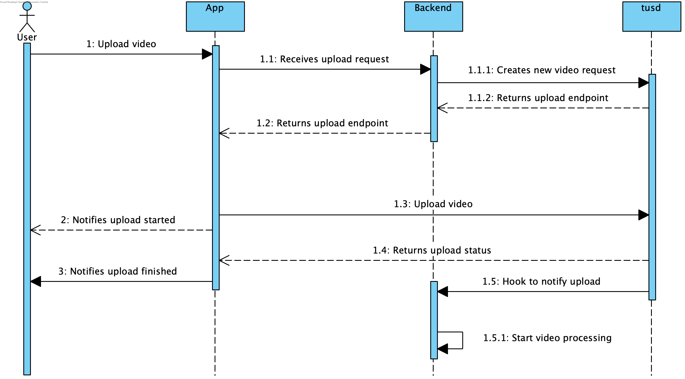

# Endpoint: `/uploads`

## Description
This endpoint initiates a file upload process by communicating with a tusd server. It requires specific headers to be included in the request and returns relevant headers from the tusd server response.

---

## **Input**

### **Required Headers**
1. **`file_name`**
    - **Description**: The name of the file to be uploaded.
    - **Type**: String
    - **Example**: `file_name: example.txt`

2. **`file_length`**
    - **Description**: The length of the file in bytes.
    - **Type**: Integer (u64)
    - **Example**: `file_length: 1024`

---

## **Response**

### **Success Response**
- **Status Code**: `200 OK`
- **Headers**:
    - **`location`**: The URL where the file will be uploaded.
        - **Example**: `location: http://localhost:1080/files/7c13f9db184c7e8ff9f6bc85c387167e`

### **Error Responses**
- **Status Code**: `400 Bad Request`
    - **Reason**: Missing or invalid `file_name` or `file_length` headers.
    - **Example Response**: `"Missing 'file_name' header"` or `"Invalid 'file_length' value"`

- **Status Code**: `500 Internal Server Error`
    - **Reason**: Failed to communicate with the tusd server.
    - **Example Response**: `"Failed to initiate upload"`